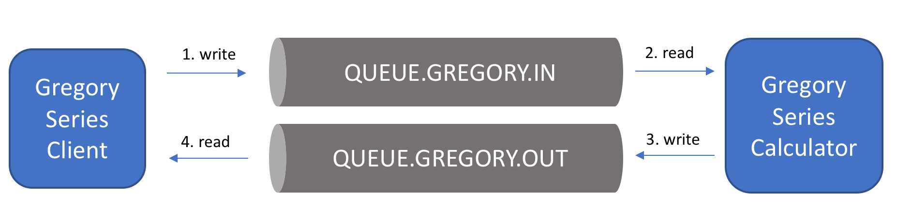

##  HvA PC :: Assignment 6
This is an exercise for the subject of CSP

## Prerequisites
You must have an IDE to work with this project. We recommend using the IntelliJ IDEA Community Edition. This IDE has good integration with Maven and JUnit.

https://www.jetbrains.com/idea/download/#section=mac

### Installation & Configuration

Download or clone this project and open it using your IDE

### Exercise

This project has distributed object implementation using a Message-Oriented Middleware ActiveMQ and JMS. It consists of three parts: 

##### Part 1: Installation of ActiveMQ

If you are using the Raspberry PI cluster, ActiveMQ is already installed on host 169.254.1.1. If not you can download it from [the ActiveMQ site](http://activemq.apache.org/). If you are a MacOS user, use brew: see the documentation [here](http://activemq.apache.org/getting-started.html#GettingStarted-UsingHomebrewinstalleronOSX).

To open the adminstration console, go to http://[host]:8161, where [host] is the name of the host where ActiveMQ is installed. The default user and password is admin/admin.

Task: Get acquainted with the views of queues and topics.

##### Part 2: First contact with Queues and Topics

The objective here is get acquainted with queues and topics. 

To follow instructions, see the TODO tab of your IDE, or look for TODO tags into the source-code

##### Part 3: An example of synchronous communication

The objective here is understand how to implement a synchronous communication using message queues.

To follow instructions, see the TODO tab of your IDE, or look for TODO tags into the source-code

